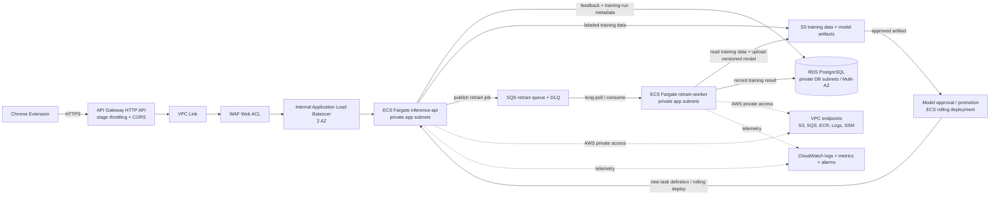

# ToxicFree AWS architecture — corrected

## Corrections from the original diagram

1. `API Gateway HTTP API` does not use REST API Usage Plans/API Keys. The Terraform config implements stage throttling and CORS; the project's API key is application-level authentication.
2. API Gateway currently proxies to a public ALB. The hardened target architecture uses a VPC Link and an internal ALB. WAF remains associated with the ALB.
3. With VPC Link, the internal ALB and both ECS services belong in private subnets without public IPs. If the current public-ALB pattern is retained, only that internet-facing ALB belongs in public subnets.
4. Private ECS tasks need NAT egress or VPC endpoints for S3, SQS, ECR, CloudWatch Logs, and SSM. The diagram uses endpoints to avoid a NAT dependency.
5. RDS stays in isolated private DB subnets and should span at least two AZs; production should enable Multi-AZ.
6. The inference API writes labeled training data to S3. It does not upload model artifacts; the worker uploads versioned artifacts.
7. Uploading a trained model to S3 does not update a running inference task. An explicit approval/promotion and ECS rolling-deployment step is required.
8. SQS triggers are asynchronous: the API publishes a job and returns immediately; the worker long-polls and consumes it.

## Current Terraform gap

The repository currently assigns public IPs to both ECS services and places them in public subnets. It also uses an HTTP proxy from API Gateway to the public ALB. The diagram above is the corrected target architecture; Terraform must be changed separately to match it.
