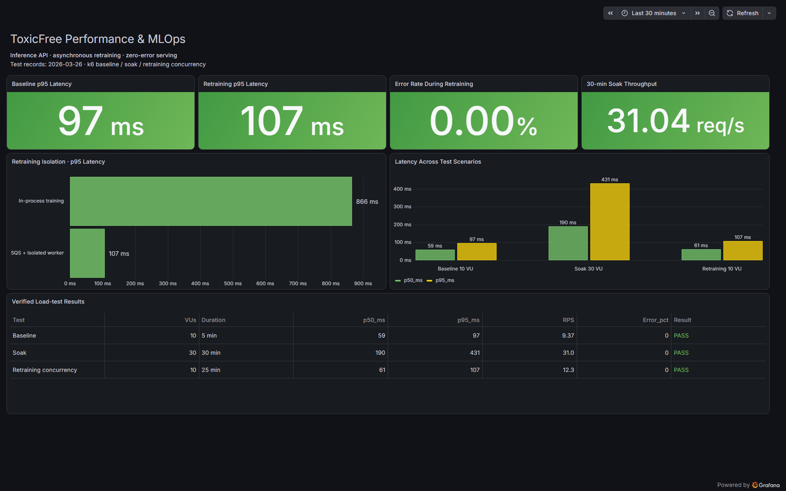
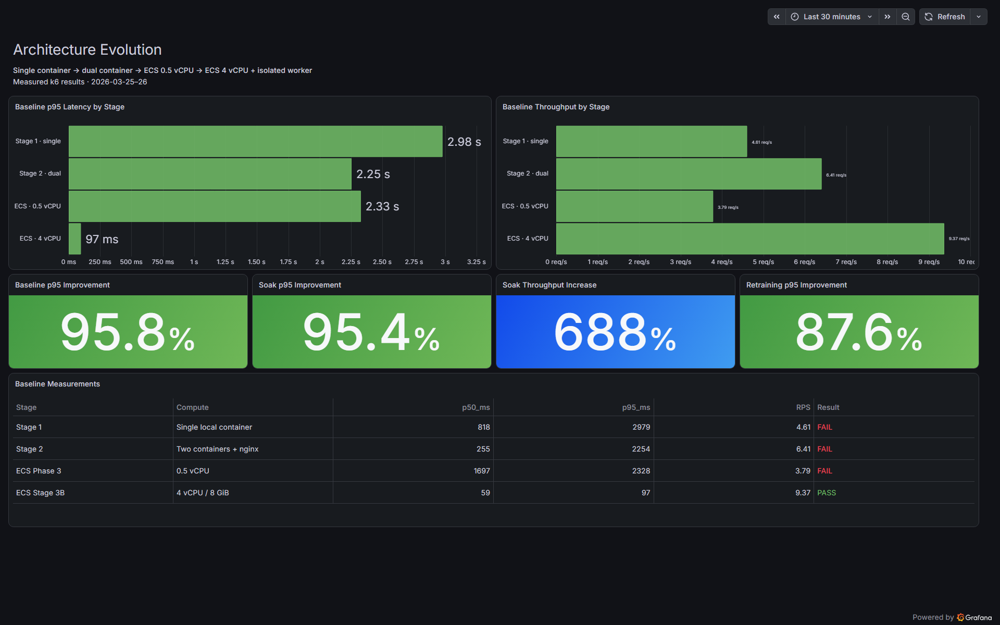
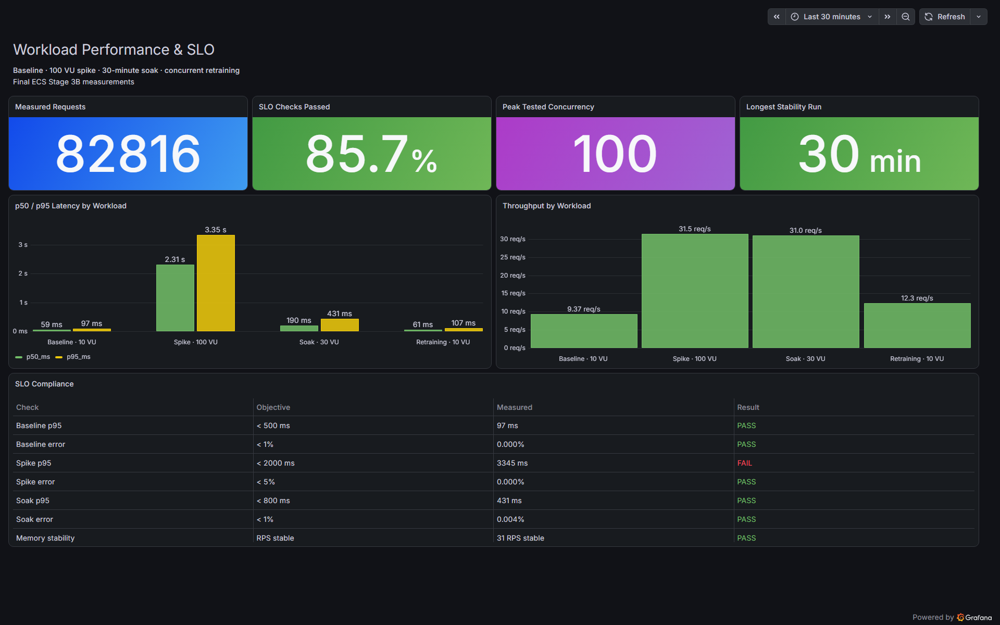
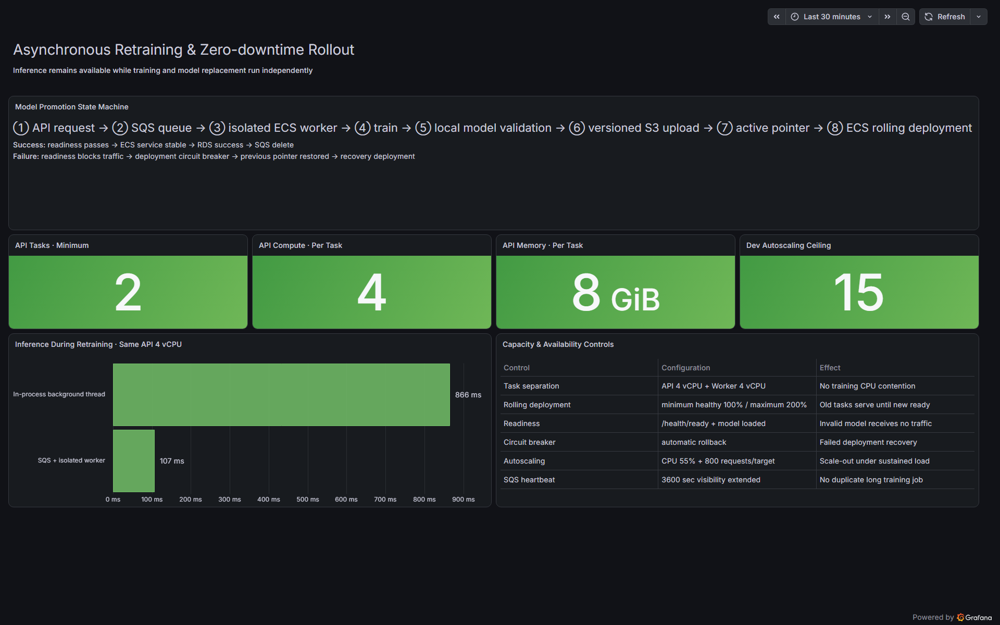

# ToxicFree 최종 성능 및 MLOps 결과

이 문서는 프로젝트에 기록된 k6 실측 결과를 Grafana로 시각화한 최종 발표 자료를 설명한다. 대시보드는 신규 예측값이 아니라 `load_tests/results/`에 보관된 실제 테스트 결과를 사용한다.

## 핵심 결과

| 항목 | 최종 결과 | 의미 |
|---|---:|---|
| 분석한 최종 ECS 요청 | 82,816건 | Baseline, Spike, Soak, 재학습 동시 테스트 합계 |
| SLO 통과율 | 85.7% | 정의된 7개 검사 중 6개 통과 |
| 최대 동시 부하 | 100 VU | 저장된 테스트 중 실제 수행된 최대 동시 사용자 |
| Baseline p95 | 97 ms | 목표 500 ms 이내, PASS |
| Spike p95 | 3,345 ms | 목표 2,000 ms 초과, FAIL |
| Spike 오류율 | 0.00% | 목표 5% 이내, PASS |
| 30분 Soak p95 | 431 ms | 목표 800 ms 이내, PASS |
| 30분 Soak 처리량 | 31.04 req/s | 0.5 vCPU 구성 대비 688% 증가 |
| 재학습 중 추론 p95 | 107 ms | 목표 500 ms 이내, PASS |
| 재학습 중 오류율 | 0.00% | 재학습과 추론의 CPU 경합 해소 |

## 1. Executive Summary

첫 화면은 발표 시 가장 먼저 보여주는 종합 요약이다.

- 일반적인 10 VU 추론에서 p95 97 ms를 기록했다.
- 별도 Worker에서 재학습하는 동안에도 추론 p95가 107 ms로 유지됐다.
- 재학습 동시 테스트의 추론 오류율은 0.00%였다.
- 30분 Soak 테스트에서는 31.04 req/s를 안정적으로 처리했다.
- 프로세스 내부 재학습과 Worker 분리 방식의 p95 차이인 866 ms → 107 ms를 보여준다.
- Baseline, Soak, 재학습 동시 테스트의 p50·p95와 판정을 한 표에서 확인할 수 있다.

이 화면이 보여주는 결론은 **재학습을 추론 API와 분리하면 학습 중에도 추론 성능을 안정적으로 유지할 수 있다**는 것이다.

## 2. Architecture Evolution

두 번째 화면은 프로젝트의 단계별 구조 개선이 성능에 미친 영향을 보여준다.

### 단계별 구조

1. Stage 1: 단일 로컬 컨테이너
2. Stage 2: 컨테이너 2개와 nginx 분산
3. ECS Phase 3: ECS Fargate 0.5 vCPU
4. ECS Stage 3B: ECS Fargate 4 vCPU/8 GiB와 별도 Worker

### 주요 개선

| 지표 | 이전 | 최종 | 개선 |
|---|---:|---:|---:|
| Baseline p95 | 2,328 ms | 97 ms | 95.8% 감소 |
| Soak p95 | 9,469 ms | 431 ms | 95.4% 감소 |
| Soak 처리량 | 3.94 req/s | 31.04 req/s | 688% 증가 |
| 재학습 중 p95 | 866 ms | 107 ms | 87.6% 감소 |

단순히 컨테이너 수만 늘린 Stage 2에서는 p95 목표를 만족하지 못했다. 최종 단계에서는 충분한 CPU 할당과 학습 Worker 분리를 함께 적용하면서 Baseline p95 목표를 통과했다.

## 3. Workloads & SLO

세 번째 화면은 부하 유형별 성능과 SLO 충족 여부를 보여준다.

### 테스트 구성

| 시나리오 | 부하 | 시간 | 요청 수 | p50 | p95 | 처리량 |
|---|---:|---:|---:|---:|---:|---:|
| Baseline | 10 VU | 5분 | 2,822 | 59 ms | 97 ms | 9.37 req/s |
| Spike | 최대 100 VU | 3분 | 5,665 | 2,310 ms | 3,345 ms | 31.46 req/s |
| Soak | 30 VU | 30분 | 55,921 | 190 ms | 431 ms | 31.04 req/s |
| 재학습 동시 추론 | 10 VU | 25분 | 18,408 | 61 ms | 107 ms | 약 12.27 req/s |

### SLO 판정

| 검사 | 목표 | 실측 | 판정 |
|---|---:|---:|:---:|
| Baseline p95 | < 500 ms | 97 ms | PASS |
| Baseline 오류율 | < 1% | 0.000% | PASS |
| Spike p95 | < 2,000 ms | 3,345 ms | **FAIL** |
| Spike 오류율 | < 5% | 0.000% | PASS |
| Soak p95 | < 800 ms | 431 ms | PASS |
| Soak 오류율 | < 1% | 0.004% | PASS |
| 장시간 안정성 | RPS 유지 | 약 31 RPS 유지 | PASS |

Spike에서는 오류 없이 요청을 처리했지만 p95가 목표를 초과했다. 이는 테스트 당시 단일 4 vCPU ECS Task에 100 VU가 집중되면서 추론 대기열이 길어진 결과다. 현재 인프라 코드에는 최소 2개 API Task와 오토스케일링이 설정되어 있으므로 이후 실제 배포 테스트에서는 수평 확장 효과를 별도로 검증해야 한다.

## 4. MLOps & Capacity

네 번째 화면은 재학습부터 모델 교체까지의 상태 전이와 현재 인프라 보호 장치를 설명한다.

### 모델 교체 과정

1. API가 재학습 실행 기록을 생성한다.
2. 해당 `run_id`를 포함한 메시지를 SQS에 전송한다.
3. 별도 ECS Worker가 메시지를 가져온다.
4. Worker가 S3 학습 데이터를 내려받아 모델을 학습한다.
5. 새 모델을 로컬에서 완전히 로드하고 라벨 수를 검증한다.
6. 검증된 모델을 버전별 S3 경로에 업로드한다.
7. `models/latest.json` 활성 모델 포인터를 갱신한다.
8. ECS API 서비스의 롤링 배포를 요청한다.
9. 새 Task가 readiness를 통과하고 ECS 서비스가 안정화된 후에만 학습 작업을 성공 처리한다.

배포에 실패하면 이전 모델 포인터를 복원하고 복구 배포를 실행한다. 따라서 잘못된 모델은 ALB의 정상 Target으로 편입되지 않는다.

### 현재 용량과 가용성 설정

| 설정 | 값 | 목적 |
|---|---:|---|
| API 최소 Task | 2개 | 롤링 교체 중 기존 Task가 계속 요청 처리 |
| API Task CPU | Task당 4 vCPU | CPU 기반 BERT 추론 처리 |
| API Task Memory | Task당 8 GiB | 모델 로드 및 동시 요청 처리 |
| Worker CPU/Memory | 4 vCPU/8 GiB | 재학습을 추론 CPU와 격리 |
| dev 오토스케일 최대 | 15 Task | 현재 계정 Fargate vCPU 한도 내 확장 |
| 배포 최소 정상 비율 | 100% | 새 Task 준비 전 기존 Task 유지 |
| 배포 최대 비율 | 200% | 기존 Task와 신규 Task 동시 실행 |
| ALB 헬스체크 | `/health/ready` | 모델이 로드된 Task만 트래픽 수신 |
| Circuit Breaker | 자동 rollback | 실패한 배포 자동 복구 |
| 오토스케일 기준 | CPU 55%, Target당 800 요청 | 지속 부하에 따라 API Task 확장 |
| SQS visibility | 3,600초 및 heartbeat 연장 | 장시간 학습의 중복 실행 방지 |

## 발표 시 권장 순서

1. Executive Summary에서 최종 성과를 먼저 제시한다.
2. Architecture Evolution에서 어떤 변경이 성능 개선을 만들었는지 설명한다.
3. Workloads & SLO에서 통과 항목과 남은 Spike 병목을 함께 보여준다.
4. MLOps & Capacity에서 비동기 재학습과 무중단 모델 교체 설계를 설명한다.

## 수치 해석 시 주의사항

- 기존 결과 파일에 기록된 최대 실측 부하는 100 VU다. 2,000 VU 결과로 해석하면 안 된다.
- 최종 k6 summary는 모든 시나리오에 대해 p99를 기록하지 않았다. 따라서 대시보드에서는 max나 과거 실행의 p99를 최종 p99로 대체하지 않았다.
- MLOps 화면의 용량 값은 현재 Terraform 설정이다. 롤링 교체 소요시간은 저장된 실측 기록이 없으므로 표시하지 않았다.
- Stage 1 Spike는 요청의 97.4%가 rate limit의 429 응답이었다. 해당 p95 210 ms는 실제 BERT 처리 성능 비교값으로 사용하지 않았다.
- Grafana 화면은 저장된 집계 결과를 표현하며 임의로 생성한 시계열을 사용하지 않는다.

## 결과 및 설정 원본

- [전체 재측정 결과](load_tests/results/2026-03-26/2026-03-26_all_stages.md)
- [재학습 동시 추론 비교](load_tests/results/2026-03-26/retrain_concurrent_comparison.md)
- [재학습 동시 테스트 raw 결과](load_tests/results/2026-03-26/phase3_retrain_concurrent_raw.txt)
- [Grafana 대시보드 정의](grafana/dashboards)
- [Grafana 수치 출처](grafana/README.md)
- [최종 아키텍처 draw.io](architecture-toxicfree-final.drawio)

## 최종 결론

최종 4 vCPU ECS 구성은 Baseline과 30분 Soak 테스트에서 SLO를 만족했고, 별도 SQS/ECS Worker 구조는 재학습 중 추론 p95를 866 ms에서 107 ms로 낮추면서 오류율을 49.93%에서 0%로 제거했다. 남은 정량적 병목은 100 VU Spike의 p95 3,345 ms이며, 다음 검증에서는 현재 구성된 최소 2개 API Task와 오토스케일링이 적용된 실제 환경에서 Spike 및 2,000 VU 부하를 측정해야 한다.
